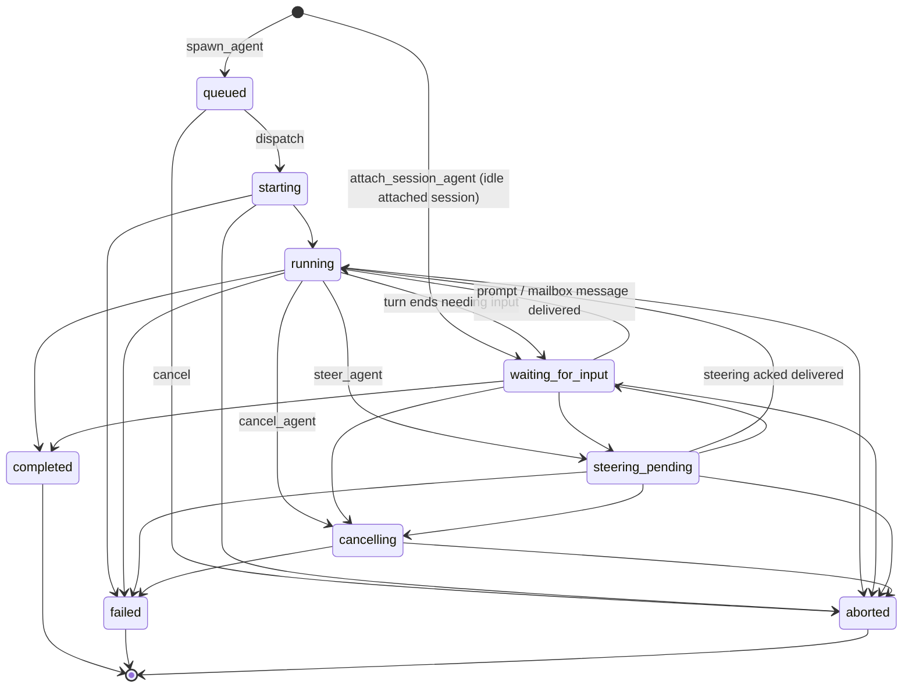

# Agent Lifecycle

The lifecycle state machine for multi-agent store agents: which states exist, what each one
means, which transitions are legal, and how restore/recovery is allowed to rewrite state.
The authoritative implementation is `ALLOWED_TRANSITIONS` in
[`packages/coding-agent/src/core/multi-agent-store.ts`](../../packages/coding-agent/src/core/multi-agent-store.ts).
How the runtime drives these transitions is described in
[docs/wiki/systems/multi-agent.md](../wiki/systems/multi-agent.md).

## State graph (implemented)

State meanings:

- `queued` — spawned, not yet dispatched. No worker, no transcript.
- `starting` / `running` — a dispatch owns the agent; a live runtime is (being) attached.
- `waiting_for_input` — idle: an attached session awaiting a prompt, or a child whose turn
  ended needing input. Nothing is executing. Not a crash/interruption state.
- `steering_pending` — a steering message is queued for a safe checkpoint.
- `cancelling` — cancel requested, terminal state pending.
- `completed` / `failed` / `aborted` — terminal; no transitions out.

## Phase 1 authority and invariants

`LifecycleCoordinator` is the sole authority for lifecycle commands. The coordinator serializes
control-plane requests and delegates persistence to a repository/SQLite transaction that repeats
transition legality and authorization checks. Detached runners are execution-plane exceptions only:
they may submit the exact terminal-finalize command for their own process identity, but cannot spawn,
dispatch, cancel, recover, or mutate graph state.

Runtime roles are exclusive:

- An orchestration-capable main runtime requires a validated execution capability before any
  orchestration tool or main-runtime listener is registered. Missing capability fails construction
  before either becomes visible.
- A child runtime is address-scoped execution only. It never receives execution capability and
  rejects orchestration commands before creating lifecycle rows.
- Help/inventory startup paths that do not construct an `AgentSession` are outside this invariant.

Every lifecycle mutation must match the persisted agent and exact owner process identity
`(session_id, agent_id, owner_session_id, owner_agent_id, pid, startTimeTicks)`. Repository code reads
and increments revision inside the SQLite transaction; callers never supply it. A terminal retry is
valid only when it is an idempotent replay of the same committed terminal event.

Dispatch and graph invariants:

- A `queued` agent is either unowned and dispatchable or owns exactly one live process identity.
  Process ownership, lifecycle state, and initial revision commit atomically.
- Child row creation, its single parent link, initial revision, and either committed process ownership
  or an explicitly unreserved dispatchable state commit atomically. Parent links cannot self-reference
  or form cycles.
- Parent cancellation cascades as cancellation intents to active descendants, but each descendant
  reaches a terminal state through its own exact-owner command. A parent remains nonterminal until every
  descendant is terminal or has been resolved as `failed` with `lost_runtime`; no terminal parent may
  coexist with a nonterminal descendant.

Race precedence is deterministic and based on coordinator commit order, not callback order, PID,
wall-clock time, or mailbox delivery:

1. A committed terminal result wins all later requests. Duplicate aborts or finalizers return the
   existing outcome and cannot advance revision or emit another terminal event.
2. An accepted cancellation request wins over a later natural-completion attempt and moves the agent
   to `cancelling`. Only an exit acknowledgement from the exact owner process identity may then
   produce `aborted`.
3. Runtime ownership is the exact Linux process identity `(pid, /proc/<pid>/stat startTimeTicks)`.
   Recovery is authorized only after that exact process identity is gone; PID reuse does not match.
4. Any late finalizer, exit acknowledgement, or outbox write from a different process identity fails
   the ownership predicate and cannot rewrite lifecycle state or terminal-event identity.

Every terminal transition commits its state/revision mutation and exactly one immutable terminal
event/outbox record in the same SQLite transaction. Event identity is unique
`(agent_id, terminal_revision, event_kind)`; the payload includes the terminal outcome, cause/error or
result reference, agent/parent identity, and authorizing process identity. Redelivery reuses the same
identity and payload. Ordinary coordinator projection is notification-free for terminal states;
only a claimed terminal outbox record may project the terminal snapshot and create its completion or
failure mailbox notification. Runtime transport uses one session-bound lifecycle mirror that is
rebound on session changes and shared by direct tools plus Hostrun/Pyrun handlers; dispatch-local
listeners are limited to desktop-notification state and do not mirror transport. Terminal outbox
claims expire after a bounded lease, stale claims requeue, delivery failures retry the same pending
mailbox record, exhausted attempts become poisoned, acknowledgements require the active claim ID,
and delivered/poisoned rows are removed only after the retention window. `wait_agents` allocates an
independent terminal-event cursor per invocation, reads committed terminal events before subscribing,
rechecks state after subscription, and never consumes the shared mailbox transport row. Concurrent
and late waiters therefore observe the same terminal revision independently. Runtime transcript
metadata updates merge into the latest persisted agent snapshot inside an immediate transaction and
cannot rewrite lifecycle or revision from a stale in-memory projection; restore never writes its
runtime-only worker-handle cleanup back to lifecycle storage. Mailbox/contact activity metadata uses
the same merge rule and no longer advances the lifecycle revision token. Pinned-slot metadata follows
the same rule, including clear operations. Generic full-row agent upsert is limited to unowned
bootstrap/migration rows through the explicitly named `bootstrapMultiAgentAgent` API and rejects
every row after runtime ownership exists. Repository transactions read current revision internally and
re-check exact session/agent/process ownership before lifecycle writes; callers never supply revision.
Schema-version startup checks reject incompatible runtimes. A source-scan regression also fails if production modules call direct store lifecycle
methods or the bootstrap writer outside authority modules. SQLite connection access control and
arbitrary same-UID raw SQL are outside this authority model.

## What it must do

### Transitions

- [x] Repository transactions read and increment revision internally; model/tool callers never supply it.
- [x] Transitions not in the allowed map are rejected with `invalid_transition`.
- [x] Terminal states (`completed`, `failed`, `aborted`) admit no further transitions.
- [x] Self-transitions are no-ops for non-terminal states and rejected for terminal states.
- [x] Steering ack with status `delivered` moves the agent back to `running`.
- [x] Spawned child dispatches drain runtime coordination before transitioning an end-of-turn child
      to `completed`, so steering racing with turn completion is delivered before terminalization and
      cannot remain pending on a terminal agent.
- [x] Cancelling an agent aborts its live runtime handle and records terminal state through
      the normal lifecycle path. Detached Pyrun jobs register that handle and terminate the
      runner process group so spawned commands cannot survive cancellation as orphans.

### Restore and recovery (derived liveness)

Shutdown ordering is strict. The runtime first stops accepting orchestration work, then invalidates
the local dispatch generation so late callbacks cannot publish into a rebound store. It locally aborts session runtimes without inventing a terminal result; persisted agents remain
recoverable regardless of whether their backing session was newly created or selected from an existing
session. Runtime mailbox polling/heartbeat stops and listener ownership retires only after local abort
dispatch completes, so no command is accepted under a listener that has already surrendered ownership.

Detached runner recovery preserves evidence rather than inferring process outcomes. The live runner
owns retries of its immutable terminal envelope. After runner loss, only the agent's owning supervisor may submit an orphan envelope through the
coordinator. The repository validates the exact runner process identity. A possibly live payload is not
proof of completion. If exact envelope finalization is no longer authorized, recovery records
`failed/lost_runtime` with outcome uncertainty. A cancellation committed before a pending natural-result
finalizer wins by transaction order; `aborted` still requires the exact runner's exit acknowledgement.

- [x] Restore never rewrites lifecycle state: it clears stale worker handles from active agents,
      and persisted metadata is never proof of liveness.
- [x] `queued` agents survive restore unchanged and are not recovered.
- [x] After a runtime registers its current mailbox listener, that session's sole supervisor reconciles
      its orphaned active rows through coordinator recovery commands. Runtime ownership stores the exact
      `(pid, startTimeTicks)` identity. A different live process identity rejects replacement. There is no
      global recovery leader: unrelated supervisor sessions never coordinate lifecycle recovery. Session
      relocation moves the assertion transactionally with the store. Verified administrative restart may
      terminalize owned work through the coordinator; exact owner-process exit resolves as
      `failed`/`lost_runtime`, never direct JSON rewrite or inferred `aborted`. Queued, terminal,
      current-live, and uncertain process-backed rows follow their explicit recovery policy.
- [x] Agents already `waiting_for_input` are idle and are not auto-prompted after restore; they resume
      only when a new prompt or mailbox message arrives.
- [x] Any detached `starting`, `running`, or `steering_pending` agent with a transcript is resumed through
      the same session dispatch path; the `origin` field records construction provenance and does not
      select runtime behavior. `cancelling` agents resolve through dead-owner recovery without restarting a prompt.
- [x] Reattaching a runtime to a detached `running` agent is not a lifecycle transition: the agent stays
      `running` while the dispatch and handle are re-established under the new process identity.
- [x] A detached in-flight agent with no transcript is marked `failed/lost_runtime` with an explicit
      recovery error at recovery time.
- [x] Session shutdown invalidates in-flight dispatches before aborting handles so
      abort-induced rejections cannot persist agents as `failed`.
- [x] Child agent runtimes register only their agent-address mailbox listener; they never register a
      same-PID main listener or run supervisor-wide recovery.
- [x] `wait_agents({})` snapshots active agents at invocation, uses an independent terminal-event
      cursor, checks committed events before and after subscription, and returns when any one becomes
      terminal. It never consumes shared mailbox delivery. Detached Bash and Pyrun jobs use a transient
      `runtime` worker marker; restore clears it without rewriting durable lifecycle.

## How it works

- [docs/wiki/systems/multi-agent.md](../wiki/systems/multi-agent.md) (stub) — runtime dispatch,
  recovery, and mailbox plumbing.
- [multi-agent.md](multi-agent.md) — the broader multi-agent contract this graph belongs to.
- [resume-session-as-agent.md](resume-session-as-agent.md) — attach/resume lifecycle specifics.

## Implementation inventory

- `packages/coding-agent/src/core/lifecycle-coordinator.ts` — sole control-plane lifecycle commands.
- `packages/coding-agent/src/core/session-control-db.ts` — exact process-owner transactions,
  terminal events/outbox, and schema/version enforcement.
- `packages/coding-agent/src/core/multi-agent-store.ts` — read/projection state, metadata, listeners,
  and restore-time removal of runtime-only worker handles; no lifecycle mutation API.
- `packages/coding-agent/extensions/agents-core/src/runtime.ts` — coordinator-backed dispatch,
  cancellation, steering, attached recovery, waits, and shutdown ordering.
- `packages/coding-agent/src/core/detached-job-lifecycle.ts` — detached runner lifecycle adapter.
- `packages/coding-agent/src/main.ts` — runtime-role/capability construction and per-session restore.

## Tests asserting this spec

- `packages/coding-agent/test/lifecycle-coordinator.test.ts` and repository tests — transition rules,
  exact process ownership, terminal immutability, recovery, and race precedence.
- `packages/coding-agent/test/multi-agent-store.test.ts` — projection, metadata, and restore behavior.
- `packages/coding-agent/test/multi-agent-extension.test.ts` — dispatch transitions, recovery
  gating, shutdown behavior, cancel/steer tool paths.
- `packages/coding-agent/test/runtime-mailbox.test.ts` — steering/mailbox-driven transitions.

## Known gaps (current cycle)

- [ ] Add `interrupted`: persisted state for agents deliberately paused by the user — a policy
      difference (never auto-restarted) that cannot be derived, unlike crash detachment.
      Blocked on a hand-interruption surface existing (today the only manual stop is
      `cancel_agent`).

## Out of scope

- A hand-interruption UI (Esc-to-pause on a child view). The `interrupted` state lands only
  when that surface exists; until then the state machine does not carry speculative states.
- Generalized per-agent-type resume routing (persisted dispatch descriptors). `origin` covers
  the only two dispatch paths that exist today.
- Merging supervisor/main-thread lifecycle into this graph; `main` is not a store agent.
