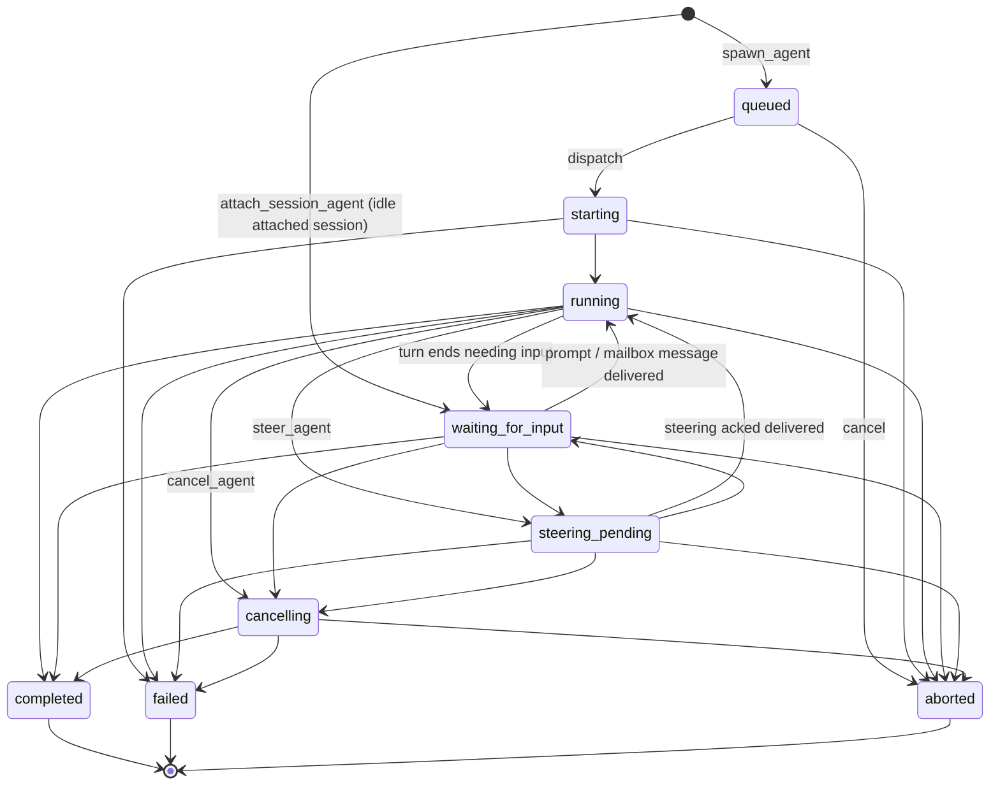

# Agent Lifecycle

The lifecycle state machine for multi-agent store agents: which states exist, what each one
means, which transitions are legal, and how restore/recovery is allowed to rewrite state.
The authoritative implementation is `ALLOWED_TRANSITIONS` in
[`packages/coding-agent/src/core/multi-agent-store.ts`](../../packages/coding-agent/src/core/multi-agent-store.ts).
How the runtime drives these transitions is described in
[docs/wiki/systems/multi-agent.md](../wiki/systems/multi-agent.md).

## State graph (implemented)

State meanings:

- `queued` — spawned, not yet dispatched. No worker, no transcript.
- `starting` / `running` — a dispatch owns the agent; a live runtime is (being) attached.
- `waiting_for_input` — idle: an attached session awaiting a prompt, or a child whose turn
  ended needing input. Nothing is executing. Not a crash/interruption state.
- `steering_pending` — a steering message is queued for a safe checkpoint.
- `cancelling` — cancel requested, terminal state pending.
- `completed` / `failed` / `aborted` — terminal; no transitions out.

## What it must do

### Transitions

- [x] Transitions are revision-checked; a stale revision is rejected with `stale_revision`.
- [x] Transitions not in the allowed map are rejected with `invalid_transition`.
- [x] Terminal states (`completed`, `failed`, `aborted`) admit no further transitions.
- [x] Self-transitions are no-ops for non-terminal states and rejected for terminal states.
- [x] Steering ack with status `delivered` moves the agent back to `running`.
- [x] Cancelling an agent aborts its live runtime handle and records terminal state through
      the normal lifecycle path. Detached Pyrun jobs register that handle and terminate the
      runner process group so spawned commands cannot survive cancellation as orphans.

### Restore and recovery (derived liveness)

- [x] Restore never rewrites lifecycle state: it clears stale worker handles from active agents,
      and persisted metadata is never proof of liveness.
- [x] `queued` agents survive restore unchanged and are not recovered.
- [x] After a runtime registers its current mailbox listener,
      `abortInactiveSessionSpawnedAgents()` globally terminalizes active spawned agents (`origin:
      "spawned"` or absent) in persisted supervisor stores with matching metadata and either an
      explicitly ended (`pid: NULL`) health row or a non-current duplicate metadata path for the
      same session ID. Main listener rows freshly assert the exact live session path and a runtime
      incarnation ID; a changed incarnation advances health generation and aborts active spawned rows
      in that exact store even when the OS has reused the same PID. A different live Pi PID already
      owning the session rejects replacement, so concurrent opens cannot abort its spawned work.
      Startup reconciliation retires listener ownership whose PID no longer belongs to Pi before
      trusting asserted paths. Reconciliation trusts a path only when its assertion timestamp matches
      the listener heartbeat, and path relocation moves the
      assertion transactionally with the store. Reconciliation writes
      `aborted` with an explicit `supervisor_restarted` interruption error, including
      `waiting_for_input`, and prevents active-count and TUI liveness ghosts in historical
      non-current stores. Attached, queued, terminal, missing-health, current live, and stale-but-
      process-backed timeout rows remain unchanged. Runtime-process verification recognizes Pi executables
      and source, Bun, or built `packages/coding-agent` entrypoints in relative or absolute form.
- [x] Attached agents already `waiting_for_input` are not auto-prompted after restore.
- [x] Only detached in-flight agents with persisted `origin: "attached"` and a transcript are
      auto-restarted through the attached-session dispatch path.
- [x] Reattaching a runtime to a detached `running` attached agent is not a lifecycle transition:
      the agent stays `running` while the dispatch and handle are re-established.
- [x] A detached in-flight attached agent with no transcript is marked `failed` with an explicit
      recovery error at recovery time.
- [x] A detached attached `cancelling` agent has its pending cancel completed to `aborted` at recovery time.
- [x] Session shutdown invalidates in-flight dispatches before aborting handles so
      abort-induced rejections cannot persist agents as `failed`.
- [x] Child agent runtimes register only their agent-address mailbox listener; they never register a
      same-PID main listener or run supervisor-wide recovery.
- [x] `wait_agent` reports an explicit wait error for every active target with no live dispatch
      or current-process worker marker instead of returning a live-looking non-terminal snapshot.
      Detached Bash and Pyrun jobs use a transient `runtime` worker marker; restore clears it
      and never keeps a wait alive.

## How it works

- [docs/wiki/systems/multi-agent.md](../wiki/systems/multi-agent.md) (stub) — runtime dispatch,
  recovery, and mailbox plumbing.
- [multi-agent.md](multi-agent.md) — the broader multi-agent contract this graph belongs to.
- [resume-session-as-agent.md](resume-session-as-agent.md) — attach/resume lifecycle specifics.

## Implementation inventory

- `packages/coding-agent/src/core/multi-agent-store.ts` — state machine (`ALLOWED_TRANSITIONS`,
  `transitionAgent`), restore-time correction (`restoreAgentSnapshot`), recovery set.
- `packages/coding-agent/extensions/agents-core/src/runtime.ts` — dispatch-driven transitions,
  session-start recovery, session-shutdown handling, cancel/steer tools.
- `packages/coding-agent/src/main.ts` — production store construction and per-session restore.

## Tests asserting this spec

- `packages/coding-agent/test/multi-agent-store.test.ts` — transition rules, revision checks,
  terminal immutability, restore/recovery corrections.
- `packages/coding-agent/test/multi-agent-extension.test.ts` — dispatch transitions, recovery
  gating, shutdown behavior, cancel/steer tool paths.
- `packages/coding-agent/test/runtime-mailbox.test.ts` — steering/mailbox-driven transitions.

## Known gaps (current cycle)

- [ ] Add `interrupted`: persisted state for agents deliberately paused by the user — a policy
      difference (never auto-restarted) that cannot be derived, unlike crash detachment.
      Blocked on a hand-interruption surface existing (today the only manual stop is
      `cancel_agent`).

## Out of scope

- A hand-interruption UI (Esc-to-pause on a child view). The `interrupted` state lands only
  when that surface exists; until then the state machine does not carry speculative states.
- Generalized per-agent-type resume routing (persisted dispatch descriptors). `origin` covers
  the only two dispatch paths that exist today.
- Merging supervisor/main-thread lifecycle into this graph; `main` is not a store agent.
