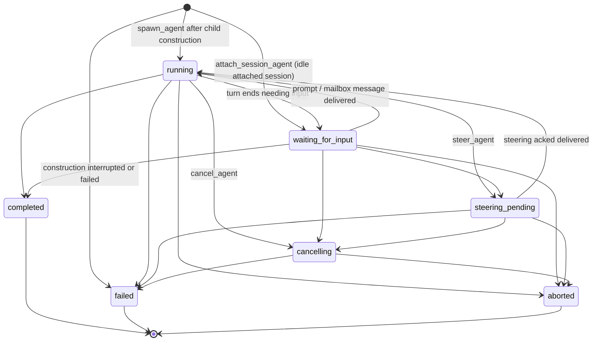

# Agent Lifecycle

The lifecycle state machine for multi-agent store agents: which states exist, what each one
means, which transitions are legal, and how restore/recovery is allowed to rewrite state.
The authoritative implementation is `ALLOWED_TRANSITIONS` in
[`packages/coding-agent/src/core/multi-agent-store.ts`](../../packages/coding-agent/src/core/multi-agent-store.ts).
How the runtime drives these transitions is described in
[docs/wiki/systems/multi-agent.md](../wiki/systems/multi-agent.md).

## State graph (implemented)

State meanings:

- `running` — child construction succeeded; the agent row is persisted at revision 1 with exact
  runtime ownership.
- `waiting_for_input` — idle: an attached session awaiting a prompt, or a child whose turn
  ended needing input. Nothing is executing. Not a crash/interruption state.
- `steering_pending` — a steering message is queued for a safe checkpoint.
- `cancelling` — cancel requested, terminal state pending.
- `completed` / `failed` / `aborted` — terminal; no transitions out.
- Construction interruption or failure persists `failed` at revision 1 with the construction error.

## Phase 1 authority and invariants

`LifecycleCoordinator` is the sole authority for lifecycle commands. The coordinator serializes
control-plane requests and delegates persistence to a repository/SQLite transaction that repeats
transition legality and authorization checks. Detached runners are execution-plane workers: they may
submit one exact terminal-finalize command using their in-memory identity, outcome, and output metadata,
but cannot spawn, dispatch, cancel, recover, or mutate graph state.

Runtime roles are exclusive:

- An orchestration-capable main runtime requires a validated execution capability before any
  orchestration tool or main-runtime listener is registered. Missing capability fails construction
  before either becomes visible.
- A child runtime is address-scoped execution only. It never receives execution capability and
  rejects orchestration commands before creating lifecycle rows.
- Help/inventory startup paths that do not construct an `AgentSession` are outside this invariant.

Every lifecycle mutation must match the persisted agent and exact owner process identity
`(session_id, agent_id, owner_session_id, owner_agent_id, pid, startTimeTicks)`. Repository code reads
and increments revision inside the SQLite transaction; callers never supply it. A terminal retry is
valid only when it is an idempotent replay of the same committed terminal row and notification.

Dispatch and graph invariants:

- Child session construction occurs before persistence. On success, the child row, its single parent link,
  exact process ownership, `running` lifecycle, and revision 1 commit atomically. Construction interruption
  or failure persists `failed` revision 1 with the construction error; no persisted `queued` or `starting`
  startup row exists. Parent links cannot self-reference or form cycles.
- Parent cancellation cascades as cancellation intents to active descendants, but each descendant
  reaches a terminal state through its own exact-owner command. A parent dispatch whose result is ready waits
  without disposing its runtime until every descendant is terminal, then commits its preserved terminal result.
  Dead-owner recovery likewise rejects a terminal parent while any descendant remains nonterminal.

Race precedence is deterministic and based on coordinator commit order, not callback order, PID,
wall-clock time, or mailbox delivery:

1. A committed terminal result wins all later requests. Duplicate aborts or finalizers return the
   existing outcome and cannot advance revision or enqueue another completion notification.
2. An accepted cancellation request wins over a later natural-completion attempt and moves the agent
   to `cancelling`. Only an exit acknowledgement from the exact owner process identity may then
   produce `aborted`.
3. Runtime ownership is agent-scoped and uses exact Linux process identity `(pid, /proc/<pid>/stat startTimeTicks)`.
   Ownership for one agent cannot authorize another agent even under the same supervisor process. Recovery is
   authorized only after that exact process identity is gone; PID reuse does not match, and zombie/exited states
   are dead before parent reaping.
4. Any late finalizer, exit acknowledgement, or outbox write from a different process identity fails
   the ownership predicate and cannot rewrite the agent row or notification identity.

A runtime cannot commit `waiting_for_input` or natural `completed` while lifecycle is
`steering_pending`. Steering enqueue, lifecycle transition, and terminal mutation serialize through
immediate SQLite transactions: steering that commits first keeps the agent active until delivery is
acknowledged back to `running`; only then may it become idle or terminal. Steering attempted after a
terminal commit receives an explicit inactive-agent rejection rather than being silently dropped.

Every terminal transition updates the agent row and revision and enqueues exactly one pending completion
or failure notification in the same SQLite transaction. The agent row is terminal truth; the outbox is
only a delivery queue. Notification delivery may retry or expire, but it never creates or replaces
terminal state. Runtime transport uses one session-bound lifecycle mirror shared by direct tools and
Hostrun/Pyrun handlers. `wait_agents` snapshots active agents, consumes one pending completion
notification, and uses that notification only to wake a query of the current agent rows. It does not
consume the runtime mailbox transport as its source of truth.
Runtime transcript metadata updates merge into the latest persisted agent snapshot inside an immediate
transaction and cannot rewrite lifecycle or revision from a stale in-memory projection; restore never
writes its runtime-only worker-handle cleanup back to lifecycle storage. Mailbox/contact activity metadata
uses the same merge rule and no longer advances the lifecycle revision token. Pinned-slot metadata follows
the same rule, including clear operations. Generic full-row agent upsert is limited to unowned
bootstrap/migration rows through the explicitly named `bootstrapMultiAgentAgent` API and rejects
every row after runtime ownership exists. Repository transactions read current revision internally and
re-check exact session/agent/process ownership before lifecycle writes; callers never supply revision.
Schema-version startup checks reject incompatible runtimes. A source-scan regression also fails if production modules call direct store lifecycle
methods or the bootstrap writer outside authority modules. SQLite connection access control and
arbitrary same-UID raw SQL are outside this authority model.

## What it must do

### Transitions

- [x] Repository transactions read and increment revision internally; model/tool callers never supply it.
- [x] Transitions not in the allowed map are rejected with `invalid_transition`.
- [x] Terminal states (`completed`, `failed`, `aborted`) admit no further transitions.
- [x] Self-transitions are no-ops for non-terminal states and rejected for terminal states.
- [x] Steering ack with status `delivered` moves the agent back to `running`.
- [x] Spawned child dispatches drain runtime coordination before transitioning an end-of-turn child
      to `completed`, so steering racing with turn completion is delivered before terminalization and
      cannot remain pending on a terminal agent.
- [x] Cancelling an agent aborts its live runtime handle and records terminal state through
      the normal lifecycle path. Detached Pyrun jobs register that handle and terminate the
      runner process group so spawned commands cannot survive cancellation as orphans.

### Restore and recovery (derived liveness)

Shutdown ordering is strict. The runtime first stops accepting orchestration work, then invalidates
the local dispatch generation so late callbacks cannot publish into a rebound store. It locally aborts session runtimes without inventing a terminal result; persisted agents remain
recoverable regardless of whether their backing session was newly created or selected from an existing
session. Runtime mailbox polling/heartbeat stops and listener ownership retires only after local abort
dispatch completes, so no command is accepted under a listener that has already surrendered ownership.

Detached runner recovery does not reconstruct terminal state from artifacts. The live runner directly
finalizes from its in-memory identity, outcome, and output metadata. The output artifact is diagnostic
only. If the runner dies before its terminal commit, the owning supervisor uses the exact persisted
process identity to mark the agent `failed/lost_runtime`; it does not replay or infer a terminal result
from the output file. A cancellation committed before a pending natural-result finalizer still wins by
transaction order; `aborted` requires the exact runner's exit acknowledgement.

- [x] Restore never rewrites lifecycle state: it clears stale worker handles from active agents,
      and persisted metadata is never proof of liveness.
- [x] After a runtime registers its current mailbox listener, the one registered supervisor binding for that
      session path reconciles its orphaned active rows through coordinator recovery commands. Runtime ownership
      stores the exact `(pid, startTimeTicks)` identity. A different live process identity rejects replacement. There is no
      global recovery leader: unrelated supervisor sessions never coordinate lifecycle recovery. Session
      relocation moves the assertion transactionally with the store. Verified administrative restart may
      terminalize owned work through the coordinator; exact owner-process exit resolves as
      `failed`/`lost_runtime`, never direct JSON rewrite or inferred `aborted`. Terminal, current-live,
      and uncertain process-backed rows follow their explicit recovery policy.
- [x] Agents already `waiting_for_input` are idle and are not auto-prompted after restore; they resume
      only when a new prompt or mailbox message arrives.
- [x] Any detached `running` or `steering_pending` agent with a transcript is resumed through the same
      session dispatch path; the `origin` field records construction provenance and does not select runtime
      behavior. `cancelling` agents resolve through dead-owner recovery without restarting a prompt.
- [x] Reattaching a runtime to a detached `running` agent is not a lifecycle transition: the agent stays
      `running` while the dispatch and handle are re-established under the new process identity.
- [x] A detached in-flight agent whose runner died before terminal commit is marked `failed/lost_runtime`
      with an explicit recovery error; output artifacts remain diagnostic and are not replayed as lifecycle proof.
- [x] Session shutdown invalidates in-flight dispatches before aborting handles so
      abort-induced rejections cannot persist agents as `failed`.
- [x] Child agent runtimes register only their agent-address mailbox listener; they never register a
      same-PID main listener or run supervisor-wide recovery.
- [x] `wait_agents({})` snapshots active agents at invocation, consumes one pending completion
      notification, and queries current agent rows until one snapshot member is terminal. Notifications
      only wake the query; they are not terminal truth. Detached Bash and Pyrun jobs use a transient
      `runtime` worker marker; restore clears it without rewriting durable lifecycle.

## How it works

- [docs/wiki/systems/multi-agent.md](../wiki/systems/multi-agent.md) (stub) — runtime dispatch,
  recovery, and mailbox plumbing.
- [multi-agent.md](multi-agent.md) — the broader multi-agent contract this graph belongs to.
- [resume-session-as-agent.md](resume-session-as-agent.md) — attach/resume lifecycle specifics.

## Implementation inventory

- `packages/coding-agent/src/core/lifecycle-coordinator.ts` — sole control-plane lifecycle commands.
- `packages/coding-agent/src/core/session-control-db.ts` — exact process-owner transactions,
  terminal agent rows, completion outbox delivery, and schema/version enforcement.
- `packages/coding-agent/src/core/multi-agent-store.ts` — read/projection state, metadata, listeners,
  and restore-time removal of runtime-only worker handles; no lifecycle mutation API.
- `packages/coding-agent/extensions/agents-core/src/runtime.ts` — coordinator-backed dispatch,
  cancellation, steering, attached recovery, waits, and shutdown ordering.
- `packages/coding-agent/src/core/detached-job-lifecycle.ts` — detached runner lifecycle adapter.
- `packages/coding-agent/src/main.ts` — runtime-role/capability construction and per-session restore.

## Tests asserting this spec

- `packages/coding-agent/test/lifecycle-coordinator.test.ts` and repository tests — transition rules,
  exact process ownership, terminal-row immutability, recovery, and race precedence.
- `packages/coding-agent/test/multi-agent-store.test.ts` — projection, metadata, and restore behavior.
- `packages/coding-agent/test/multi-agent-extension.test.ts` — dispatch transitions, recovery
  gating, shutdown behavior, cancel/steer tool paths.
- `packages/coding-agent/test/runtime-mailbox.test.ts` — steering/mailbox-driven transitions.

## Known gaps (current cycle)

- [ ] Add `interrupted`: persisted state for agents deliberately paused by the user — a policy
      difference (never auto-restarted) that cannot be derived, unlike crash detachment.
      Blocked on a hand-interruption surface existing (today the only manual stop is
      `cancel_agent`).

## Out of scope

- A hand-interruption UI (Esc-to-pause on a child view). The `interrupted` state lands only
  when that surface exists; until then the state machine does not carry speculative states.
- Generalized per-agent-type resume routing (persisted dispatch descriptors). `origin` covers
  the only two dispatch paths that exist today.
- Merging supervisor/main-thread lifecycle into this graph; `main` is not a store agent.
