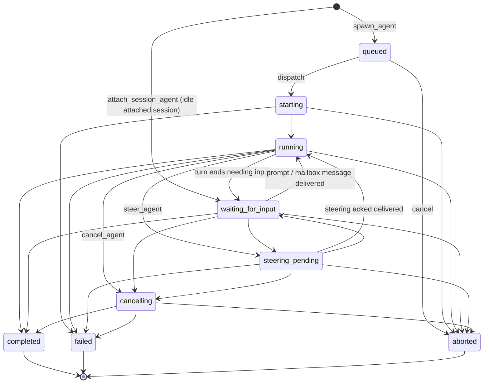

# Agent Lifecycle

The lifecycle state machine for multi-agent store agents: which states exist, what each one
means, which transitions are legal, and how restore/recovery is allowed to rewrite state.
The authoritative implementation is `ALLOWED_TRANSITIONS` in
[`packages/coding-agent/src/core/multi-agent-store.ts`](../../packages/coding-agent/src/core/multi-agent-store.ts).
How the runtime drives these transitions is described in
[docs/wiki/systems/multi-agent.md](../wiki/systems/multi-agent.md) (stub).

## State graph (implemented)

State meanings:

- `queued` — spawned, not yet dispatched. No worker, no transcript.
- `starting` / `running` — a dispatch owns the agent; a live runtime is (being) attached.
- `waiting_for_input` — idle: an attached session awaiting a prompt, or a child whose turn
  ended needing input. Nothing is executing. Not a crash/interruption state.
- `steering_pending` — a steering message is queued for a safe checkpoint.
- `cancelling` — cancel requested, terminal state pending.
- `completed` / `failed` / `aborted` — terminal; no transitions out.

## What it must do

### Transitions

- [x] Transitions are revision-checked; a stale revision is rejected with `stale_revision`.
- [x] Transitions not in the allowed map are rejected with `invalid_transition`.
- [x] Terminal states (`completed`, `failed`, `aborted`) admit no further transitions.
- [x] Self-transitions are no-ops for non-terminal states and rejected for terminal states.
- [x] Steering ack with status `delivered` moves the agent back to `running`.
- [x] Cancelling an agent aborts its live runtime handle and records terminal state through
      the normal lifecycle path.

### Restore and recovery (current shape)

- [x] Restore clears stale worker handles from all active agents; persisted metadata is never
      treated as proof of liveness.
- [x] Interrupted in-flight agents (`starting`/`running`/`steering_pending`/`cancelling`) with a
      transcript path are moved to a resumable waiting state; without a transcript they are
      marked `failed` with an explicit recovery error.
- [x] `queued` agents survive restore unchanged.
- [x] Agents already `waiting_for_input` before the crash are not auto-prompted after restore.
- [x] Only agents with persisted `origin: "attached"` are auto-restarted, through the
      attached-session dispatch path; recovered spawned children stay resumable and are not
      re-driven through the attach factory.
- [x] Session shutdown invalidates in-flight dispatches before aborting handles so
      abort-induced rejections cannot persist agents as `failed`.

## How it works

- [docs/wiki/systems/multi-agent.md](../wiki/systems/multi-agent.md) (stub) — runtime dispatch,
  recovery, and mailbox plumbing.
- [multi-agent.md](multi-agent.md) — the broader multi-agent contract this graph belongs to.
- [resume-session-as-agent.md](resume-session-as-agent.md) — attach/resume lifecycle specifics.

## Implementation inventory

- `packages/coding-agent/src/core/multi-agent-store.ts` — state machine (`ALLOWED_TRANSITIONS`,
  `transitionAgent`), restore-time correction (`restoreAgentSnapshot`), recovery set.
- `packages/coding-agent/extensions/agents-core/src/runtime.ts` — dispatch-driven transitions,
  session-start recovery, session-shutdown handling, cancel/steer tools.
- `packages/coding-agent/src/main.ts` — production store construction and per-session restore.

## Tests asserting this spec

- `packages/coding-agent/test/multi-agent-store.test.ts` — transition rules, revision checks,
  terminal immutability, restore/recovery corrections.
- `packages/coding-agent/test/multi-agent-extension.test.ts` — dispatch transitions, recovery
  gating, shutdown behavior, cancel/steer tool paths.
- `packages/coding-agent/test/runtime-mailbox.test.ts` — steering/mailbox-driven transitions.

## Known gaps (current cycle)

The restore-time "resumable waiting state" above is a design flaw being driven out:
restore rewrites a crashed `running` agent to `waiting_for_input` (a state that otherwise
means "idle"), then needs an in-memory `recoveredAgentIds` side-set to remember which
"waiting" agents are actually interrupted — and that set does not survive a second restart.

Planned model — derived liveness, no restore-time rewrite:

The last written lifecycle is the truth. At crash the snapshot already says `running`;
restore loads it as-is (clearing only `worker` handles, which are runtime metadata and never
proof of liveness). Whether an agent needs starting is **derived at session start**, not
stored: an agent in an active non-idle state with no live dispatch in this process is
detached and gets started.

- [ ] Restore stops rewriting lifecycle state entirely; `restoreAgentSnapshot` only clears
      `worker` handles. `recoveredAgentIds` is deleted.
- [ ] Session-start recovery derives the work list: active non-idle lifecycle AND no entry in
      the live dispatch map. Agents with `origin: "attached"` and a transcript restart through
      the attach factory; an agent with no transcript is marked `failed` with the recovery
      error at recovery time (a runtime decision, not a restore rewrite).
- [ ] Detached-but-active agents that cannot be restarted yet (spawned children) keep their
      truthful lifecycle; projections must expose detachment (active agent, no runtime) so the
      TUI does not show false liveness while no resume path exists.
- [ ] `wait_agent` must handle detached-active agents (no dispatch to await) instead of
      returning a live-looking non-terminal snapshot immediately.
- [ ] Add `interrupted`: persisted state for agents deliberately paused by the user — a policy
      difference (never auto-restarted) that cannot be derived, unlike crash detachment.
      Blocked on a hand-interruption surface existing (today the only manual stop is
      `cancel_agent`).

## Out of scope

- A hand-interruption UI (Esc-to-pause on a child view). The `interrupted` state lands only
  when that surface exists; until then the state machine does not carry speculative states.
- Generalized per-agent-type resume routing (persisted dispatch descriptors). `origin` covers
  the only two dispatch paths that exist today.
- Merging supervisor/main-thread lifecycle into this graph; `main` is not a store agent.
